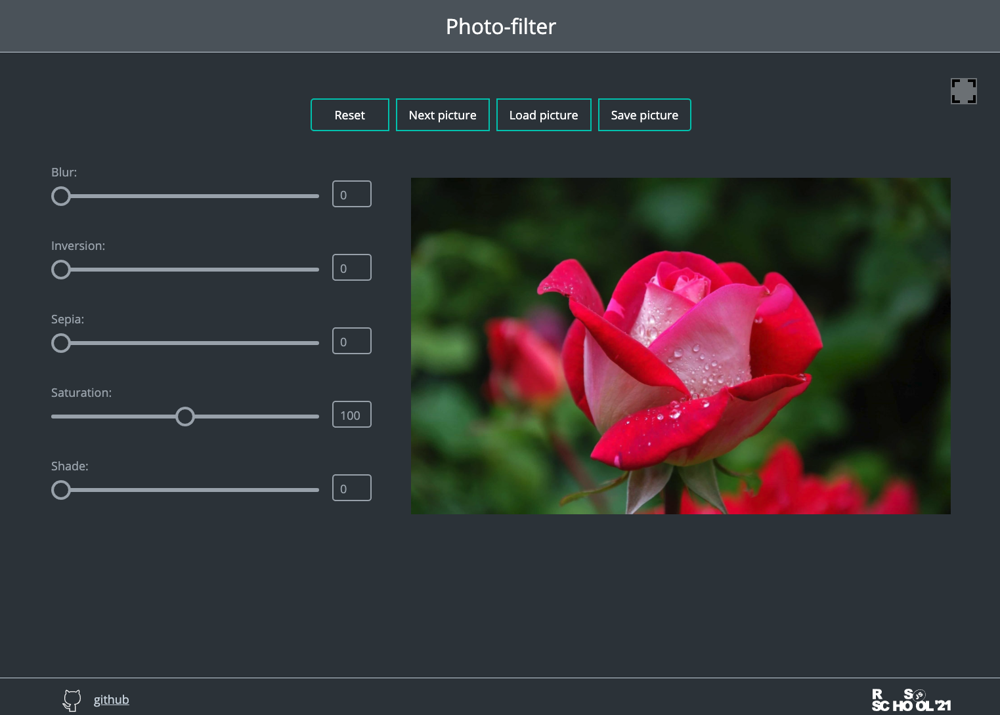

# photo-filter

| Дата выдачи | Deadline         | Folder name   | Branch name   |
| ------------| ---------------- | ------------- | ------------- |
| 23.03.2021  | 29.03.2021 23:59 | photo-filter  | photo-filter  |

В первую очередь ознакомьтесь с [инструкцией к заданию](tasks/js-projects.md) 

## Task 2. photo-filter

[Демо](https://www.cssfiltergenerator.com/)

[Файлы проекта](https://github.com/rolling-scopes-school/stage1-tasks/tree/photo-filter/photo-filter)

[Советы по написанию кода](tasks/photo-filter-hints.md)

В ходе выполнения задания вам необходимо создать приложение позволяющее наложить css-фильтры на фото. Фото в приложение можно загрузить с компьютера. Также есть возможность скачать фото с наложенными фильтрами на компьютер. 

## Структура и работа приложения
- на странице отображается фото и настройки css-фильтров в виде ползунков, каждому из которых соответствует определённый css-фильтр
- фото в приложение можно загрузить с компьютера, для этого в приложении есть кнопка Загрузить
- есть возможность скачать фото с наложенными фильтрами на компьютер, для этого в приложении есть кнопка Скачать

## Функциональность приложения
-  напротив каждого ползунка есть окно, в котором отображается значение соответствующего css-фильтра. при перемещении ползунка значение изменяется
- при перемещении ползунка меняется внешний вид фото в соответствии с изменением значения соответствующего css-фильтра
- при клике по кнопке Загрузить открывается окно выбора файлов на компьютер, выбранное фото отображается в приложении
- при клике по Скачать фото загружается на компьютер вместе с наложенными фильтрами

## Критерии оценки

**Максимальный балл за задание +50**
- реализовано не меньше 5 ползунков для настройки css-фильтров. Возле каждого ползунка отображается его актуальное значение +5
- при перемещении ползунка меняется внешний вид фото в соответствии с изменением значения соответствующего css-фильтра +10
- изображение можно загрузить по ссылке из интернета +5
- изображение можно загрузить с локального компьютера +10
- изображение можно скачать на компьютер +10
- изображение скачивается на компьютер с применёнными фильтрами +10

## Ключевые навыки
- использование js для загрузки локальных файлов на веб-страницу
- использовать js для сохранения сanwas как изображения на компьютер
- Canwas API

## Материалы:

### Теория
- [<input>](https://developer.mozilla.org/ru/docs/Web/HTML/Element/Input)
- [input type="range"](https://developer.mozilla.org/ru/docs/Web/HTML/Element/Input/range)
- [<output>: Элемент вывода](https://developer.mozilla.org/ru/docs/Web/HTML/Element/output)
- [События: change, input](https://learn.javascript.ru/events-change-input)
- [Element.matches()](https://developer.mozilla.org/ru/docs/Web/API/Element/matches)
- [CSS Filters](https://css-tricks.com/almanac/properties/f/filter/)
- [CSS Filters for Online Photo Editing](https://orangeable.com/css/filters)
- [Использование переменных в CSS](https://developer.mozilla.org/ru/docs/Web/CSS/Using_CSS_custom_properties)
- [Изучите CSS-переменные за 5 минут](https://medium.com/devschacht/изучите-css-переменные-за-5-минут-3a5dc6193857)

- https://developer.mozilla.org/en-US/docs/Web/API/CanvasRenderingContext2D/filter
- https://codepen.io/lqez/pen/vYNpVbW
- https://orangeable.com/css/filters

### Видео
- [JS30. CSS Variables](https://youtu.be/AHLNzv13c2I)

### Демо для вдохновения
- [Магия фильтров: 9 интересных приложений для обработки фото](https://asn24.ru/sova/community/magiya-filtrov-9-interesnykh-prilozheniy-dlya-obrabotki-foto-v-instagram/)

[Документ для вопросов](https://docs.google.com/spreadsheets/d/1dMDLBC4-1XPaVMehZB6DqetToXZhq4x0PiZtj-jvLRc/edit#gid=487334651)

## Cross-check
- инструкция по проведению cross-check: https://docs.rs.school/#/cross-check-flow
- ссылки на лучшие работы, добавьте, пожалуйста, в эту форму [https://forms.gle/QELfqGDNCaPLHMzo9](https://docs.google.com/forms/d/e/1FAIpQLSc7DQoF0U4lB2qdMceofIl1F59UFS-pQAfQfJwcAc4nIXn31g/viewform?usp=sf_link)